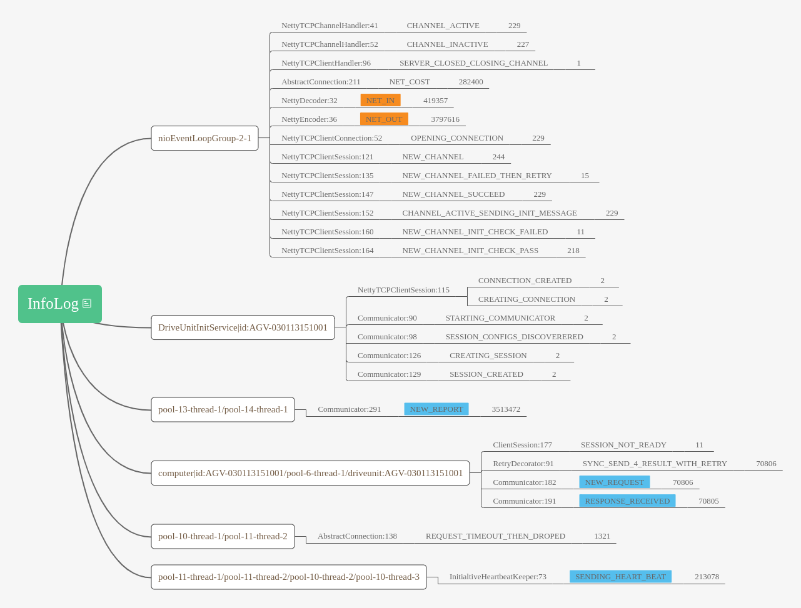
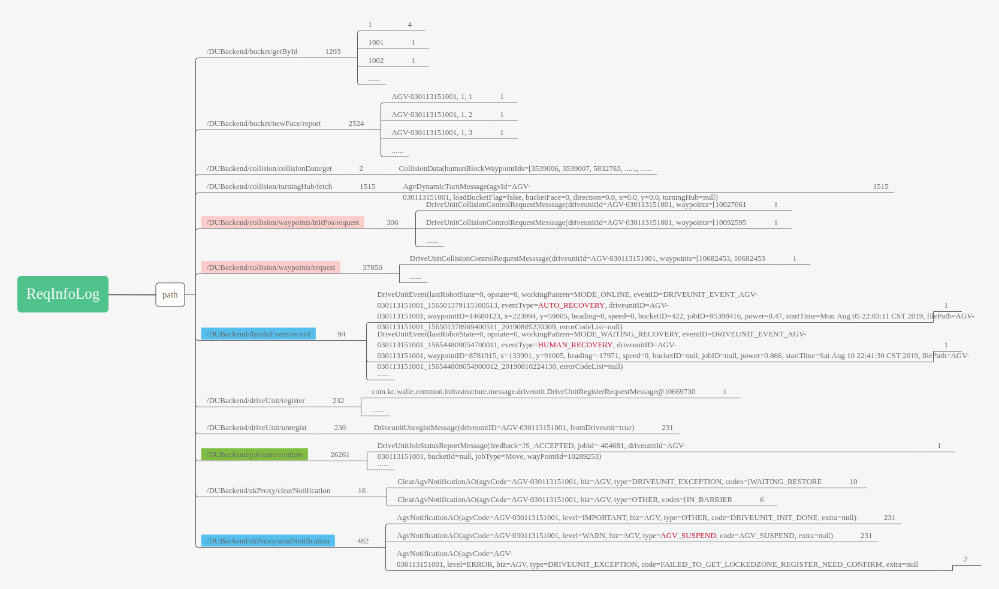
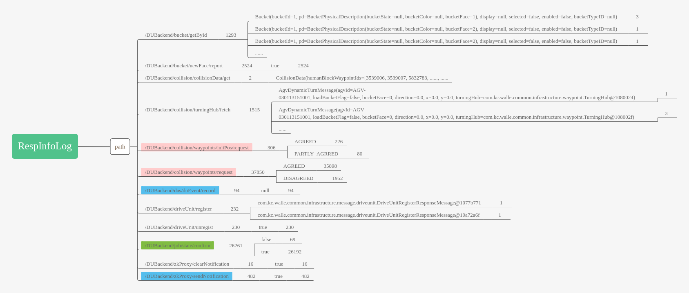
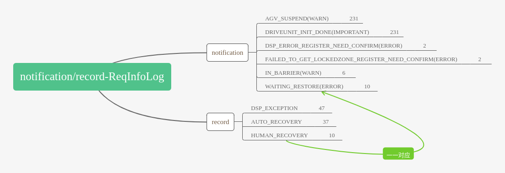

# 网络数据分析

[TOC]

## 一　分析目标

+ 全面分析AGV无线控制网络的性能，着重探究MPTCP协议在移动场景中的协议行为，网络性能．
+ 定位掉线与通信时延大的问题．
+ 六大块内容
  1. 基站覆盖分析：刻画基站覆盖情况，发现基站覆盖空白；统计关联基站的最小RSSI与未关联基站的最大RSSI．
  2. 掉线分析：刻画掉线情况，定位掉线原因．
  3. 漫游分析：刻画漫游情况，探究漫游算法性能，分析漫游对MPTCP协议行为，网络性能的影响．
  4. 时延分析：刻画时延情况，定位时延大原因，探究srtt机制性能．
  5. MPTCP协议分析：分析路径管理模块，拥塞控制模块，流量调度模块在移动场景中，漫游事件下的行为．
  6. 应用特征分析

***

## 二　数据整理

### 2.1 scan文件分析

1. scan测量脚本逻辑：双层循环，外层为死循环，脚本一直运行；内层为每5000次循环新建一个"scan.`date +%s`.dat"测量结果文件，每次循环中，使用`iwlist scan`分别扫描wlan0，wlan1的基站，提取"mac地址，essid，频率，信道，quality，level"写入测量结果文件．
2. quality与level分析
   1. cfg80211假设RSSI在区间[-110, -40]dBm。quality = (level + 110) / 70 * 100。
   2. wlan1的quality只有0/100与100/100，且一般只有当前关联的基站为100/100、其余基站为0/100，没有参考价值，直接丢弃。
   3. wlan0的quality与level之间的关系也只是简单的quality * 70 - 110 = level，也没有参考价值，直接丢弃。
   4. 假设wlan1的level是按照quality的计算公式得出，那么将其还原为RSSI。
3. scan文件空洞分析
   1. scan文件交替测量WLAN0与WLAN1，空洞定义为既没有测量WLAN0，也没有测量WLAN1的时段，分为两种情况：两次测量的间隙，以及脚本宕掉。
4. 测量机制的书面化描述：使用`iwlist dev scan`工具交替测量附近的WLAN0与WLAN1基站，测量时间一般为几秒，测量间隔一般为几十毫秒．
5. 数据解析
   1. 解析时间戳精度为秒，由于测量时间为数秒，因此一次测量结果用于填充这数秒的数据．
   2. 一次测量结束时也会使用`iwconfig dev`工具打印当前连接基站信息，~~提取此数据缓解conn文件测量空洞的问题，填补时刻为测量结束时刻etime~~。

***

### 2.2 conn文件分析

1. conn测量脚本逻辑：双层循环，外层为死循环，脚本一直运行；内层为每100w次循环新建一个"conn.`date +%s`.dat"测量结果文件，每次循环中，使用`iwconfig`分别测量连接wlan0, wlan1的基站状态，提取"quality, level, noise（wlan0没有）"，并与上一时刻的基站状态比较，变化才写入测量结果文件．
2. wlan0的quality与level的关系与scan文件的一致，但是wlan1的存在不一致现象。
3. conn文件空洞分析
   1. conn文件也是交替测量WLAN0与WLAN1，但是对WLAN0，几乎每秒都有多个测量数据，对WLAN1，则往往数秒才有一个数据。因此分别统计WLAN0与WLAN1的空洞。
   2. 同样空洞有两种情况：两次测量的间隙，以及脚本宕掉。
4. 测量机制的书面化描述：使用`iwconfig dev`工具交替测量当前连接的WLAN0与WLAN1基站，测量时间可忽略不计，~~对WLAN0，测量间隔一般为几百毫秒；对WLAN1，测量间隔达到了数秒~~．
5. 数据解析
   1. 解析时间戳精度为~~毫~~微秒，以秒为精度对齐时，选择1s内多次测量结果中RSSI最大的数据．
6. 如何区分未关联基站时刻与数据空洞：只将'Not-Associated'认为未关联基站，并将此作为漫游事件的判定依据．

***

### 2.3 tcpprobe文件分析

1. tcpprobe工具依赖内核jprobe机制在`tcp_rcv_established()`函数入口处插入探测函数，记录当前TCP状态．
2. 由于`tcp_rcv_established()`函数是处理处于established状态的TCP连接收包，因此观察不到TCP连接的建立与关闭。
3. tcpprobe文件只能获得MPTCP连接当前正在使用的TCP子流的状态信息，且由于map_data_len、map_data_seq、map_subseq全为0，不能反推MPTCP连接的状态信息。
4. 数据解析
   1. 解析时间戳精度为~~毫~~微秒，以秒为精度对齐时，选择1s内多次测量结果中srtt最小的数据．
5. tcpprobe文件字段与TCP状态信息对应关系分析
   1. `u8 mptcp_tcp_sock::path_index`与`unsigned long mptcp_cb::path_index_bits`相对应。path_index_bits是位图，相应位置1表示某条子流标志1 << path_index；meta-sk，master-sk，slave-sk的path_index从0，1，2递增，但是master-sk与slave-sk可能变动。在`mptcp_add_sock()`中给path_index赋新值并记录到path_index_bits，在`mptcp_del_sock()`中清除path_index_bits对应子流的掩码；因此不同时间的不同子流可能有相同path_index。
   2. `u32 mptcp_tcp_sock::snt_isn`与`u32 mptcp_tcp_sock::rcv_isn`等于`u32 tcp_sock::snt_isn`与`u32 tcp_sock::rcv_isn`。
6. 确定tcpprobe工具的启动参数
   1. 目测服务器端口有两个：7070和7001，其中tcpdump文件7001端口的数据包极少，可能一个文件就几十个，而tcpprobe文件中没有7001的数据。
   2. 目测tcpprobe文件1s内有好几个收包。
   3. 因此tcpprobe工具应该是运行在AGV上，通过dport=7070来监听与服务器的连接，通过full=1记录每一个收包。

| tcpprobe字段     | 含义                  | 对应TCP状态信息                                              |
| ---------------- | --------------------- | ------------------------------------------------------------ |
| src              | ip:port，AGV的地址    | inet_sock::inet_saddr + inet_sport                           |
| dst              | ip:port，服务器的地址 | inet_sock::inet_daddr + inet_dport                           |
| length           | tcp包长度：首部+数据  |                                                              |
| snd_nxt          |                       | tcp_sock::snd_nxt                                            |
| snd_una          |                       | tcp_sock::snd_una                                            |
| snd_cwnd         | 字节还是包数          | tcp_sock::snd_cwnd                                           |
| ssthresh         | 字节还是包数          | 可以认为等于tcp_sock::snd_ssthresh                           |
| snd_wnd          |                       | tcp_sock::snd_wnd                                            |
| srtt             | 单位us                | tcp_sock::srtt_us >> 3，/* smoothed round trip time << 3 in usecs */ |
| rcv_wnd          |                       | tcp_sock::rcv_wnd                                            |
| path_index       |                       | mptcp_tcp_sock::path_index                                   |
| ~~map_data_len~~ | 全为0                 | mptcp_tcp_sock::map_data_len                                 |
| ~~map_data_seq~~ | 全为0                 | mptcp_tcp_sock::map_data_seq                                 |
| ~~map_subseq~~   | 全为0                 | mptcp_tcp_sock::subseq                                       |
| snt_isn          |                       | mptcp_tcp_sock::snt_isn, /* isn: needed to translate abs to relative subflow seqnums */ |
| rcv_isn          |                       | mptcp_tcp_sock::rcv_isn                                      |

***

### 2.4 tcpdump文件分析

#### 2.4.1 提取完整mptcp连接

使用如下工具提取完整mptcp连接进行分析：

1. mptcpsplit
   1. `mptcpsplit -l pcap_filename`：读pcap文件列出所有mptcp连接信息。每行格式如下：`four_tuple connection_num first_timestamp last_timestamp duration`
   2. `mptcpsplit -n connection_num -o outfile_filename pcap_filename`：读pcap文件并将connection_num所属的所有数据包写入outfile_filename。
2. mptcpcrunch
   1. `mptcpcrunch filename`：测试是否filename有什么错误
   2. `mptcpcrunch -s filename`：输出subflow信息到stdout，每条子流三行，第一行为subflow number，二三行为单向统计信息。所有数据项格式都为`LABEL: DATA`。
   3. `mptcpcrunch -c filename`：输出connection信息到stdout，三行，第一行为meta信息，第二三行为单向连接信息。所有数据项格式都为`LABEL: DATA`。
3. mptcpplot
   1. `mptcpplot -a -j pcap_file`：根据一个pcap文件生成连接级别的time sequence图表，输出三个文件`connection_0-MAPPING.txt`, `connection_0-ORIGIN.xpl`, `connection_0-REMOTE.xpl`，默认在当前文件夹下且不能控制．
   2. time sequence图有三类主要符号：
      1. data segments : 垂直线段，两端有箭头．从数据包的开始到结束序列号．
      2. data acknowledgments : 小方块．
      3. green acknowledgment line : 绿色横线表明当前累计确认序列号即snd_una．
   3. 两类补充符号：
      1. `-a` : 追踪ADD_ADDRESS与REMOVE_ADDRESS选项．
      2. `-j` : 追踪MP_JOIN选项．
4. xplot.org : `xplot.org time_sequence_graph_name.xpl`渲染时序图

#### 2.4.2 解析pcap文件

使用mptcp-scapy解析pcap文件，只能在python2下运行．

***

### 2.5 comm文件分析

#### 2.5.1 InfoLog分析

1. 分析一号车日志，根据日志等级划分为info, debug, warn．由于绝大部分日志为info级别，因此对其深入探究，得到如下日志结构图：一级主题代表info日志；二级主题代表高层logger；三级主题代表底层具体logger；四级主题代表logType；五级主题代表日志数量．
2. AGV采用Netty为网络编程框架，其中使用nioEventLoopGroup为reactor反应器，用于网络事件监听与分发；使用NettyTCPChannel抽象网络事件及操作；使用NettyTCPClient抽象网络连接客户端；使用NettyTCPConnection抽象网络连接；使用NettyTCPSession管理会话．除此之外，还有一堆Communicator业务线程．
3. 最重要的组件是NettyDecoder与NettyEncoder，负责收发网络数据的编解码．与之直接相关的日志类型为NET_IN与NET_OUT．
4. 其中与NET_OUT相关的日志类型包括NEW_REPORT:上报agv状态；NEW_REQUEST:任务请求；SENDING_HEART_BEAT:定时发送心跳包．
5. 与NET_IN相关的日志类型包括RESPONSE_RECEIVED:服务器对NEW_REQUEST的应答；以及服务器对SENDING_HEART_BEAT的心跳应答（agv端没有日志类型）．
6. 日志之间关系可通过msgId进行关联追踪，如匹配RESPONSE_RECEIVED的collaborationId字段与NEW_REQUEST的id字段；匹配NET_IN的collaborationId字段与SENDING_HEART_BEAT的id字段，

#### 2.5.2 reqInfoLog, respInfoLog分析

1. 进一步分析日志级别info中的日志类型NEW_REQUEST与RESPONSE_RECEIVED，根据path字段以及objects字段划分日志：一级主题代表resp或req日志；三级主题为path字段分类；四级主题代表日志数量；五级主题分别为resp或req日志对应的objects字段，即请求或响应的内容；六级主题代表更细分的日志数量．
2. 需要关注的path字段类型有三类：分别是红色主题：路径申请相关；蓝色主题：异常事件相关；绿色主题：当前任务状态确认．

#### 2.5.3 notification/record-ReqInfoLog分析

进一步分析日志级别info中的日志类型 NEW_REQUEST 中的path= /DUBackend/das/duEvent/record与 path=/DUBackend/zkProxy/sendNotification日志：对于record日志，关注workingPattern与eventType字段，并与mptcp掉线事件对比，未发现明显关联，说明record记录的并不是网络导致的问题事件；对于notification日志，发现AGV_SUSPEND(WARN) 事件与mptcp掉线事件有关联，且观察前5条 AGV_SUSPEND(WARN) 事件，发现发生时刻都为mptcp恢复连接时刻．

使用日志类型NEW_REPORT文件替换最初的未分类日志文件进行agv状态提取，使用1号车数据测试发现以前未提取的字段[dspConnected, liftupTime, mileage, bucketCode, sleeping, exceptionCode, warehouseId, seq, upSeq, downSeq]皆只有一个取值，这次同样不提取．

***

### 2.6 测量文件空洞分析

统计comm文件，ping文件，tcpprobe文件，conn文件测量空洞探究是否有测量脚本单独drop或集体drop（AGV宕机）．

***

### 2.7 数据清洗　

1. 补全：对data.csv，填补curTimestamp，conn测量信息，srtt，w0PingRtt，w1PingRtt.
2. 去重：~~对conn文件和comm文件进行去重处理，1号车connData.csv行数从7775775到5295694，commData.csv行数从6247790到2615033．~~
3. 去除离群值：使用分位数，具体问题具体分析．
4. 去除异常值：主要是补全值与缺失但未进行补全的值．具体问题具体分析．

***

## 三　描述分析

描述统计分为两大部分：数据描述和指标统计。

1. 数据描述：用来对数据进行基本情况的刻画，包括：数据总数、时间跨度、时间粒度、空间范围、空间粒度等。如果是建模，那么还要看数据的极值、分布、离散度等内容。
2. 指标统计：分析实际情况的数据指标，可粗略分为四大类：变化、分布、对比、预测．
3. 图表：CDF图，柱状图，散点图，折线图，热力图．<u>箱型图</u>，<u>小提琴图</u>

***

### 3.1 基站覆盖分析

刻画基站覆盖情况，发现基站覆盖空白．

统计关联基站的最小RSSI与未关联基站的最大RSSI．

1. 非图表型统计数据：连接基站的rssi数据总数   wlan0过滤level=0speed=0后数据总数   wlan1过滤level=0speed=0后数据总数   wlan0过滤level=0后数据总数   wlan1过滤level=0后数据总数   start   end   duration   时间粒度   WLAN0最小RSSI   WLAN0最大RSSI   WLAN1最小RSSI   WLAN1最大RSSI   WLAN0 Not-Associated数据总数   WLAN1 Not-Associated数据总数   WLAN0未关联基站最大RSSI1   WLAN0未关联基站最大RSSI2   WLAN1未关联基站最大RSSI1   WLAN1未关联基站最大RSSI2   agvWalk 
2. 粗粒度分析
   1. AGV连接基站的RSSI分布CDF图
   2. rssi与时延关系图
   3. 基站覆盖热力图
   4. 基站覆盖空白热力图
   5. 有效基站覆盖热力图
   6. 有效基站覆盖空白热力图
   7. 基站rssi/时延分布等高线图

***

### 3.2 掉线分析

刻画掉线情况，定位掉线原因．

***

### 3.3 漫游分析

刻画漫游情况，探究漫游算法性能，分析漫游对MPTCP协议行为，网络性能的影响．

根据conn文件分析结论，划分漫游为以下三种情况：

1. AP1->Not-Associated->AP2，统计数据中flag=0
2. AP1->Not-Associated->AP1，统计数据中flag=1
3. ~~AP1->AP2，统计数据中flag=2~~
4. ~~AP1->' '->AP2~~

1. 非图表型统计数据：WLAN0漫游次数，WLAN0 flag=0漫游次数，WLAN0 flag=1漫游次数，WLAN0 flag=2漫游次数，WLAN1漫游次数，WLAN1 flag=0漫游次数，WLAN1 flag=1漫游次数，WLAN1 flag=2漫游次数，漫游时间戳粒度
2. 粗粒度分析
   1. 漫游热力图
   2. 漫游时长CDF图
   3. 漫游时长分类柱状图：`['<=200ms', '200ms-1s', '1s-5s', '>5s']`
   4. 漫游类型分类柱状图：`flag = {0, 1, 2}`
   5. 漫游RSSI增益CDF：RSSI值可简单使用关联基站时刻的RSSI值。
      + 不同时长分类的RSSI增益没有明显区别，不需要研究
      + 不同类型分类的RSSI增益理论上有明显区别
   6. 在将时间戳精度提高到us后，1号车WLAN0漫游次数来到了2813次，WLAN1漫游次数来到了3411次。同时网络层时延对比不再有多少意义，因为网络层时延精度为s。
3. 细粒度分析
   1. 漫游事件全景图
   2. 漫游事件RSSI分析图
      1. 漫游事件的时间戳精度为us，而scan得到的基站数据时间戳精度为s，且往往测量时间长达数秒，综合以上情况将分析图时间戳精度设置为s．
      2. 通常flag=1类型的漫游导致RSSI增益较小或为负，且flag=1的漫游后往往紧接着发生flag=0的漫游，间隔在1s以内．
      3. 如何从1号车WLAN0的2800多次漫游事件中选择**表现力最好**且能**发现问题**的图片
         1. 手动过滤：可保证发现问题
         2. 程序过滤：设置过滤条件例如数据完整性，保证表现力．

***

### 3.4 时延分析

刻画时延情况，定位时延大原因，探究srtt机制性能．

***

### 3.5 MPTCP协议分析

分析路径管理模块，拥塞控制模块，流量调度模块在移动场景中，漫游事件下的行为．

tcpprobe文件中为什么map_data_len、map_data_seq、map_subseq都为0，snt_isn与rcv_isn有时候也为0？

1. 非图表型统计数据：tcpprobe收包总数，start，end，duration，tcpprobe时间粒度．
2. 粗粒度分析
   1. mptcp/subflow连接长度小提琴图，流量分配饼状图
3. 细粒度分析：
   2. 漫游事件前后mptcp时序图

***

### 3.6 应用特征分析

使用时间戳精度为s的data.csv文件而不是时间戳精度为ms的commData.csv文件，因为涉及到时长等统计．

1. 非图表数据：任务总数，任务总时间，空闲总时间，任务时间粒度
2. 粗粒度分析
   1. 分类任务时长与距离直方图
3. 细粒度分析
   1. AGV跨层分析图（一次任务为粒度）

***

## 四　洞察结论

## 五　建模分析

## 当前情况

1. 对这批数据的认识比较深了
2. 有很多描述性的图表
3. 缺少发现问题的关键性的结论，以及性能的评估．

***

## 代码要点[^修改代码需要注意的地方]

1. read_csv()是否需要加na_filter参数，来避免空字符串被转换为nan．
2. ~~connData.csv是否有按时间戳进行排序．~~
3. 图片长宽比：默认(6.4, 4.8)，热力图(11.0, 5.7)，特殊如rssi与时延关系图/掉线次数折线图(12.8, 4.8)，漫游事件全景图(180.0, 4.8)；图片dpi设置：默认200，热力图150，特殊如漫游事件全景图100．
4. 是否需要使用tight_layout()调整图片布局．
5. 热力图统计数据写入文件方式：list手动格式化写入则没有行列信息；list转dataframe自动写入则携带行列信息，通过index=False与header=False参数设置不写入行列信息．
7. pd.cut()切分漫游时长，时延时注意左闭右开，以与业务掉线>=30s保持一致性．
7. 当某些数据时间戳精度提升到us后，需要注意相关运算如*\* 1e6*的数据类型为float．